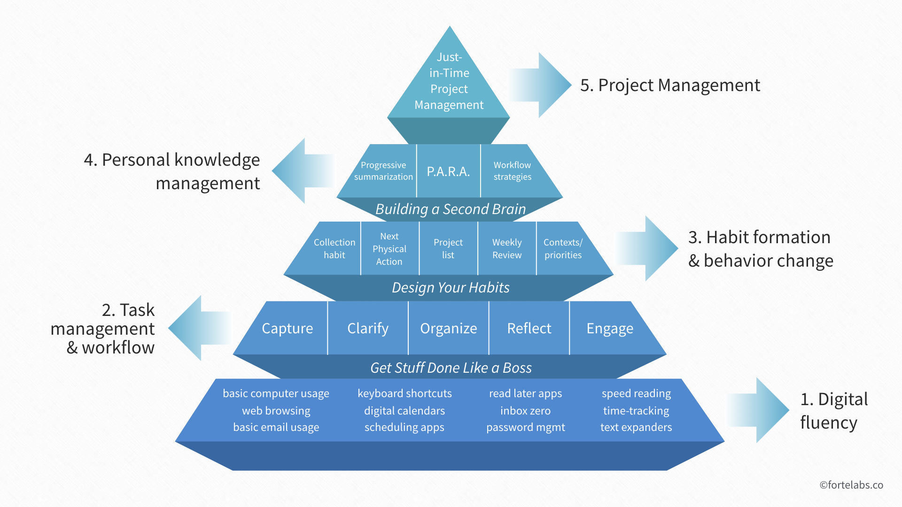

# 装了啥（2021）

---

> 参考自：[装了啥 - 云谦](https://github.com/sorrycc/awesome-tools)

---

[Tiago Forte 生产力金字塔](https://fortelabs.co/blog/the-digital-productivity-pyramid/)

## 上网

(paradiseduo)

## 软件和工具

这些拆到单独的文章了

- [Mac](/workspace/mac)
- [Chrome](/workspace/chrome)
- [VS Code](/workspace/vscode)

## 网站及服务

- 技术学习和生产
  - [Google](https://www.google.com/)
  - [YouTube](https://www.youtube.com/)
  - [GitHub](https://github.com/)
  - [Stack Overflow](https://stackoverflow.com/)
- 网站部署
  - [Vercel](https://vercel.com/)：静态托管服务
  - [阿里云域名](https://wanwang.aliyun.com/)：网站域名
- 小工具
  - [A SOFT MURMUR](https://asoftmurmur.com/)：白噪声
  - [astralapp](https://app.astralapp.com/dashboard)：GitHub Star 管理器（你是不是也把 star 当收藏夹用？）
  - [bundlephobia](https://bundlephobia.com/package/rxjs)：npm 包分析

## 关爱你的数据

- [数据备份 之 3-2-1 原则](https://sspai.com/post/39591)
- 云存储（热文件、碎片化信息）
  - OneNote：快取笔记
  - OneDrive：主要的云盘
  - [MEGA sync](https://mega.nz/)：可以筛掉 node_modules，放了两个玩具项目和 rualc （因为本地有很多草稿文章）
  - Google Photos：手机拍的照片自动备份
- 物理存储（大文件、磁盘、冷存储）
  - [选固态](https://zhuanlan.zhihu.com/p/166162142)
  - [选机械](https://zhuanlan.zhihu.com/p/147065869)
  - 选 U 盘用 SSD：[低功耗 NVME 电流在 2.0A 以下的就不会特别烫](https://www.chiphell.com/forum.php?mod=viewthread&tid=2163456)

## 通勤装备

- 背包：谷歌开发者大会纪念背包
  - MacBook Air (M1, 2020) 16G-256G
  - 收纳板：cocoon grid it
    - 512G U 盘（用来做 Time Machine、iPhone 备份，sata m.2 固态 + 壳）
    - 几个小 U 盘（用来做系统安装盘）
    - N 合 1 Hub，应急用
    - 一堆线材，一堆 Type-C 转接头
  - 充电头：倍思 GaN 2C1A 65W
  - 紫米无线充电宝
- 其他
  - 小米手环 5 NFC 版
  - AirPods Pro（噪用和全家桶设备间切换真好用）
  - KeySmart 钥匙扣
  - 双面公交卡套
- 手机
  - 手机
    - iPhone 12
    - 红米 K40
  - 流量
    - 移动：8 元低保套餐
    - 联通：O 粉卡
    - 电信：家里宽带送的

## 固定位硬件

保证每个工作区都有一组合适的外设，以便接上主力 MBP 提供最大生产力。

- 每个地方都 +1 的外设
  - 34 寸 3440x1440 直屏（大屏即正义！），AOC、ViewSonic 之类的正经牌子哪个有折扣买哪个，平均两千元左右一块，固定位共三块
  - GaN 的 2C1A 65W 充电头可以说是很香了，倍思和征拓各两个，一共四个（固定位三个 + 通勤一个）（倍思的指示灯就是太亮了…）
  - 小米手写板（有时写写草稿可以说是多快好省了）
  - 苹果的触控板（接 Mac）
- 公司
  - DockCase P1 QC，作为 MBP 的供电和 USB Hub（考虑到稳定性，视讯线单独接一根在 Type-C 口上）
  - 键盘：NIZ Plum 84
  - 苹果的鼠标（不常用）
- 出租屋
  - Mac Mini M1 8G+256G（可以说是最低配了，冲浪/写玩具用）
  - 一台游戏 PC（配置略，最近吃灰了）
  - 键盘：Keychron K3（可以不同设备间蓝牙切换）
  - 鼠标：罗技 M590（接 PC）
  - 铁威马 D4-300
    - 希捷酷鹰 4T \* 2 （Raid 1）
  - 某便宜的 23 寸显示器（接不同设备应急用）
- 选配结构件
  - 爱格升显示器支架（之前用过乐歌的关节处不太行）
  - Jugar 极架（金属木板架子，纵向堆设备用）

## 游戏机

- PS4 Pro 港版（借同学了）
- Xbox Series S 德亚（XGPU 真香，手机串流真香）
- Switch 初版 日版（吃灰很久了）
