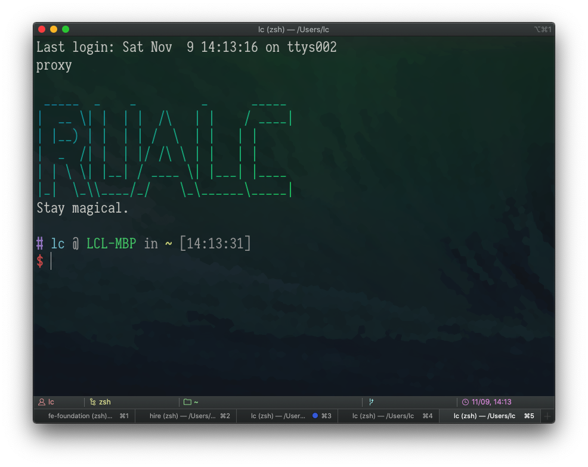

# 打造趁手的终端

## 代理（proxy）

在上一篇文章 [命令行简介](/workspace/introduction-to-terminal) 中，我们提到代理有诸多好处，正确配置或能直接提高生产效率。给浏览器、软件、Terminal 或是其他工具配置代理，不同工具的配置方式可能不同。

对于 Terminal 来说是通过命令来配置（参考 [Set HTTP(s) Proxy in Windows Command Line / MAC Terminal](https://itectec.com/set-https-proxy-in-windows-command-line-environment/) 这篇文章）：

```shell
# 其中的 http://127.0.0.1:1080 改成自己的代理地址

# mac
export ALL_PROXY='http://127.0.0.1:1080'

# windows
set http_proxy='http://127.0.0.1:1080'
set https_proxy='http://127.0.0.1:1080'
```

可以根据需要到自己的 shell 配置文件（如 `~/.bashrc`、`~/.zshrc`）中，封装成函数，以便更方便地控制启用。

```bash
# ~/.zshrc
function proxyon() {
  export ALL_PROXY='http://127.0.0.1:1080'
}

function proxyoff() {
  unset ALL_PROXY
}

# （启动 shell 时）直接运行 proxyon，启用代理
proxyon
```

测试代理的连通性，可以在 terminal 中尝试用 `curl` 命令访问网站：

```shell
curl google.com
# curl zhihu.com
# curl baidu.com
```

如果能成功返回 HTML 结果，而不是无响应或错误信息，即说明配置有效：

<!-- prettier-ignore -->
```html
<HTML><HEAD><meta http-equiv="content-type" content="text/html;charset=utf-8">
<TITLE>301 Moved</TITLE></HEAD><BODY>
<H1>301 Moved</H1>
The document has moved
<A HREF="http://www.google.com/">here</A>.
</BODY></HTML>
```

## Homebrew

> 从命令行中安装工具和软件

MacOS 生态有中有一个名为 [Homebrew](https://brew.sh/) 的命令行工具（需要额外安装）

它类似 Linux 中的 `apt` 或 `yum`，Windows 中的 [Chocolatey](https://chocolatey.org/)。  
或类似 Node.js 的 `npm`、Python 的 `pip`、PHP 的 `composer` …

虽然上述各种工具是不同生态中的不同工具，但它们有一个共同点：通过命令行安装其他程序。不需要再通过浏览器手动点击下载，软件环境的配置过程能够更方便和高效。

### 安装 Homebrew

（可以先调整好代理，这样 brew 的下载速度可能会更快。）

[安装 Homebrew](https://brew.sh/)：

```shell
/bin/bash -c "$(curl -fsSL https://raw.githubusercontent.com/Homebrew/install/HEAD/install.sh)"
```

安装完成后在命令行中键入命令 `brew`，将会打印 brew 自带的帮助文档：

```shell
Example usage:
  brew search TEXT|/REGEX/
  brew info [FORMULA|CASK...]
  brew install FORMULA|CASK...
  brew update
  brew upgrade [FORMULA|CASK...]
  brew uninstall FORMULA|CASK...
  brew list [FORMULA|CASK...]

Troubleshooting:
  brew config
  brew doctor
  brew install --verbose --debug FORMULA|CASK

Contributing:
  brew create URL [--no-fetch]
  brew edit [FORMULA|CASK...]

Further help:
  brew commands
  brew help [COMMAND]
  man brew
  https://docs.brew.sh
```

然后我们尝试使用，例如 node 的安装卸载：

```shell
brew install node
brew uninstall node
brew upgrade node
brew info node
```

brew 整合了 formula（针对命令行工具如 `node`） 和 cask（针对 GUI 软件如 `visual-studio-code`）。

```shell
brew install node
brew install visual-studio-code
brew list
brew list --formula
brew list --cask
```

#### （可选）安装 brew-cask-upgrade

[brew-cask-upgrade](https://github.com/buo/homebrew-cask-upgrade) 是 `brew upgrade --cask` 的社区增强版工具。cask 默认的升级策略是跳过那些本身自带更新功能的软件，而 cu 的管理更细致。

#### 小贴士：软件仓库

上述提到的管理工具本身都是下载管理工具，它们不保存第三方软件的安装包，而只是维护下载地址。如果某软件的下载地址不在维护列表内，无法检索到也就无法安装了。

这时候就需要设置额外的地址进行下载安装。  
（一般会借助 `sh`、`wget`、`curl` 等命令进行下载和安装）

例如在 Ubuntu 中安装 Node.js：

```shell
sudo apt-get install -y nodejs
```

默认的 apt 源并不维护最新的 Node.js 版本，所以如果需要安装较新的 _Node.js 16_，就需要进行额外配置（参考 [Installation instructions - NodeSource](https://github.com/nodesource/distributions/blob/master/README.md#debinstall) 这篇文章）：

```shell
curl -fsSL https://deb.nodesource.com/setup_16.x | sudo -E bash -
sudo apt-get install -y nodejs
```

## 打造趁手的终端 {#zsh}

个人使用的命令行基本作业环境是：`iTerm2 + zsh + oh-my-zsh`，来代替 MacOS 自带的 `Terminal.app + bash` 方案。

（另一个流行的配置集是：[Spaceship ZSH](https://github.com/denysdovhan/spaceship-prompt)）

- [iTerm2](https://iterm2.com/)：一个 terminal
  - `brew install iterm2`
- [zsh](https://github.com/ohmyzsh/ohmyzsh/wiki/Installing-ZSH#how-to-install-zsh-on-many-platforms)：一个 shell
  - `brew install zsh`
  - （安装完后会自动生成启动配置文件 `~/.zshrc`，可以在这个文件中进行深入定制）
- [Oh My Zsh](https://github.com/ohmyzsh/ohmyzsh#getting-started)：一个流行的 zsh 配置集
  - `sh -c "$(curl -fsSL https://raw.githubusercontent.com/ohmyzsh/ohmyzsh/master/tools/install.sh)"`
- [zsh-syntax-highlighting](https://github.com/zsh-users/zsh-syntax-highlighting/blob/master/INSTALL.md#oh-my-zsh)：命令语法高亮插件
  - （这个是较新的版本，brew 源较旧）`git clone https://github.com/zsh-users/zsh-syntax-highlighting.git ${ZSH_CUSTOM:-~/.oh-my-zsh/custom}/plugins/zsh-syntax-highlighting`
  - 修改 `~/.zshrc` 文件 `plugins=([...] zsh-syntax-highlighting)`
- [zsh-autosuggestions](https://github.com/zsh-users/zsh-autosuggestions/blob/master/INSTALL.md#oh-my-zsh)：根据 history 的自动补全插件
  - （这个是较新的版本，brew 源较旧）`git clone https://github.com/zsh-users/zsh-autosuggestions ${ZSH_CUSTOM:-~/.oh-my-zsh/custom}/plugins/zsh-autosuggestions`
  - 修改 `~/.zshrc` 文件 `plugins=([...] zsh-autosuggestions)`

接着可以参考我的另一篇文章 [Mac 和软件](/workspace/mac)，安装一些其他的工具。


