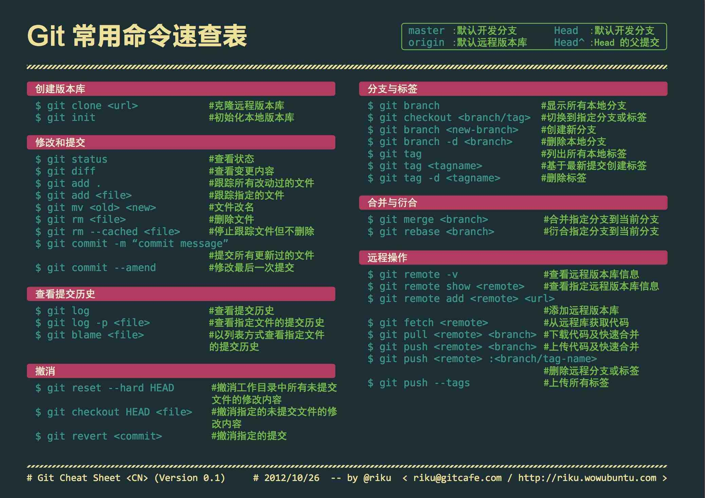

# Git 学习指南

## Git 简介

### 什么是 Git

Git 是一个流行的文件版本管理工具。

基于 Git 本体还衍生了出很多相关工具，如：

- 图形化的 Git 管理界面
- 各种 Git Diff 编辑器
- Git 规范提交工具

等…这些工具围绕 Git 配合着一同工作。

### 安装和打开 Git

基础的 Git 工具需要基于命令行，  
（参考我的另一篇文章 [命令行简介](/workspace/introduction-to-terminal)）

用 Brew 安装 Git：`brew install git`

然后在命令行中输入以下命令，查看 git 的情况：

```bash
# shell

tldr git # tldr

git version # 查看版本
git help # 查看帮助
```

### 学习 Git 需要先学一门编程语言吗

不需要。

Git 的作用是管理**文件内容**的版本，而不是**代码内容**的，  
不需要先学习一门编程语言。

甚至如果你不是开发人员，也可以利用 Git，  
用于管理 '.psd'、游戏存档…、诗集、文稿等等…

比如 [本站](http://rualc.com/) 一开始就是仅由两篇文章组成。

### 为什么要用 Git

- 可以方便地管理文件的多个版本，轻松回退切换
- 在产业界广泛被使用
- 使多人协作更好进行
  - 使开发工作更好地并行化

### GitHub 社区

GitHub 是一个免费的 Git 远端仓库，  
有很多著名的项目和工具都托管在 GitHub 上，  
如 [VS Code](https://github.com/microsoft/vscode)、 [React](https://github.com/facebook/react) 等

（类似的远端仓库还有 [GitLab](https://about.gitlab.com/)、[Bitbucket](https://bitbucket.org/product/)、[CODING](https://coding.net/) 等）

GitHub 也是一个社区和服务，除 Git 基本功能外还有很多其他功能，  
如 issues 系统，page 服务 等  
[什么是 GitHub？](https://www.bilibili.com/video/av22883127)

## 学习 Git

### 概览

- 耗时：从入门到掌握基本命令到理解理念需要大约 1~10 小时 （个人估计）
- 难点：
  - 操作规范性/开发工作流程
  - 了解一些不常用的命令的用途
- 工具：
  - [git](https://git-scm.com/)
  - [GitHub 账号](https://github.com/)

### 学习路线

- 练习 Git 基本用法
  - 完整的提交合并等操作
- 练习使用 Git Flow 开发模型
- 练习 Git 其他常用命令
- 理解操作规范
  - branch 和 commit 的合理运用方式
  - 约定式提交

## 资料

如果可以，开两个 Github 账号，以便自己尝试 `pull request` 等功能

### 自学教材

- 视频
  - [Git & Github 超简单入门教学 10 分钟学会使用 github！](https://www.bilibili.com/video/av62967996)
  - [什么是 GitHub？](https://www.bilibili.com/video/av22883127)
  - [Git and GitHub for Poets - Daniel Shiffman](https://www.youtube.com/playlist?list=PLRqwX-V7Uu6ZF9C0YMKuns9sLDzK6zoiV)
- 教程
  - [Git 菜单](https://github.com/geeeeeeeeek/git-recipes/blob/master/README.md)
  - [Git 教程 - 廖雪峰](https://www.liaoxuefeng.com/wiki/896043488029600)
  - [Introduction to Git Use](https://developpaper.com/introduction-to-git-use/)
- 在线练习
  - [学习 Git 分支](https://learngitbranching.js.org/)：在线编程闯关式教程（右下角可调中文）
  - [Git 与 GitHub 入门实践](https://www.shiyanlou.com/courses/1035)：提供了一个在线虚拟环境可供练习
- Git Flow
  - [Introducing GitFlow](https://datasift.github.io/gitflow/IntroducingGitFlow.html)
  - [A successful Git branching model](https://nvie.com/posts/a-successful-git-branching-model/)
  - [Gitflow — Branch Guide](https://medium.com/@rafavinnce/gitflow-branch-guide-8a523360c053)
  - [Git 工作流程 - 阮一峰](http://www.ruanyifeng.com/blog/2015/12/git-workflow.html)
- GitHub
  - [GitHub 漫游指南 - Phodal](http://github.phodal.com/)
  - [GitHub Guides](https://guides.github.com/)
    - [使用 GitHub 操作自动化工作流程](https://help.github.com/cn/actions)

### 进阶

- [Git Merge - Atlassian Tutorials](https://www.atlassian.com/git/tutorials/using-branches/git-merge)
- [Advanced Git log - Atlassian Tutorials](https://www.atlassian.com/git/tutorials/git-log)
- [What is the difference between `git merge` and `git merge --no-ff`?](https://stackoverflow.com/questions/9069061/what-is-the-difference-between-git-merge-and-git-merge-no-ff)
- [Git 协同与提交规范](https://www.yuque.com/fe9/basic/nruxq8)

* [Pro Git](https://git-scm.com/book/zh/v2)

## Git 知识体系

### Git & Git Flow

- Git
  - 基本操作
    - `init`、`add/reset`、`commit`、`checkout`、`merge`、`pull/push/fetch`、`remote`
  - 其他常用操作
    - `stash`、`revert`、`rebase`、`diff`、`cherry-pick`
- Git Flow 分支模型
  - `master`
  - `release`
  - `develop`
  - `feature`
  - `fix`

### Git 工具

- CLI
  - [Git](https://git-scm.com/)
    - `brew install git`
    - [How to Install Git on Linux, Mac or Windows](https://www.linode.com/docs/guides/how-to-install-git-on-linux-mac-and-windows/)
  - [Tig](https://github.com/jonas/tig)
    - `brew install tig`
    - 相当于命令行版的 'source-tree'
    - Git 自带的 `git log --oneline --decorate --all --graph` 也能达到类似效果
  - [gitignore.io](https://www.gitignore.io/)
    - 自动生成 gitignore 的工具
- GUI
  - [Sourcetree](https://www.sourcetreeapp.com/)
    - `brew cask install sourcetree`
    - 好用的图形化 Git 管理器
  - [GitHub Desktop](https://desktop.github.com/)
    - `brew cask install github`
    - GitHub 官方出品 GUI 管理器，对 GitHub 本身比较友好

### Git 周边生态

- Git Flow 工作流模型
- `--no-ff` (no fast forward merge) 参数，使 merge 的时候总是建立新提交，保持各分支含义清晰。
- 语义化版本（[Semantic Versioning](https://semver.org/lang/zh-CN/)）
  - [conventional-changelog/standard-version](https://github.com/conventional-changelog/standard-version)
  - `npm i -g standard-version`
- 约定式提交（[Conventional Commits](https://www.conventionalcommits.org/zh-hans/)）
  - [commitizen/cz-cli](https://github.com/commitizen/cz-cli)
  - `npm i -g commitizen`
- changelog（[conventional-changelog](https://github.com/conventional-changelog/conventional-changelog)）
- [submodule](https://git-scm.com/book/zh/v2/Git-%E5%B7%A5%E5%85%B7-%E5%AD%90%E6%A8%A1%E5%9D%97)/[lerna](https://github.com/lerna/lerna)，管理多仓库项目的方式
- badge（[shields.io](https://shields.io/)），为项目提供元信息图标

## Git 知识体系（图）

### Git cheatsheet



### Git Flow


### Git 思维导图


> [如何优雅的使用 Git？](https://www.zhihu.com/question/20866683/answer/975066538)

## Git 典型命令

### Git 基本命令

```bash
# shell

git init

git status
git log

git add <. | files-names >
git commit -m <messages>

git branch <new-branch>
git checkout <existed-branch>
git checkout -b <new-branch> <based-branch>

git merge [--no-ff] <from-branch>

get reset [--hard] <existed-branch>

git fetch --all
git pull <origin> <master>
git push <origin> <master>
```

### Alias

[oh-my-zsh](/workspace/terminal-settings#zsh) 预设增强了 git 的 alias，  
配合 [tig](https://github.com/jonas/tig) 和 [git-cz](https://github.com/commitizen/cz-cli)，以及 [zsh-autosuggestions](https://github.com/zsh-users/zsh-autosuggestions)，  
可以有效提升命令行中的 git 操作体验。

oh-my-zsh 中的部分常用 alias 如下：

```bash
# * ---------------- 文件变更

ga='git add'
gaa='git add --all'

gsta -u='git stash -u'
gstaa='git stash apply'

gss='git status -s'

git cz # 安装 git-cz 后可代替原有的 commit 命令

grh='git reset'
grhh='git reset --hard'

# * ---------------- 分支增删改查

gfa='git fetch --all --prune'

gl='git pull'

gp='git push'
gpf='git push --force-with-lease'
gpsup='git push --set-upstream origin $(git_current_branch)'
gpoat='git push origin --all && git push origin --tags'

gco='git checkout'
gcb='git checkout -b'
gcm='git checkout master'
gcd='git checkout develop'

gbd='git branch -d'
gbD='git branch -D'
gp origin -d xxx

# * ---------------- 合并和基变

gm='git merge'
gm --no-ff --no-edit xxx
gm --squash xxx

grb='git rebase'
grbm='git rebase master'
grbc='git rebase --continue'
```

### Git 实用命令

我将一些实用的命令封装成 `shell` 函数，可以分析 `git` 提交情况

以 React Repo 为例

```bash
git clone https://github.com/facebook/react
cd react
```

#### 统计 repo 中的所有协作者

```bash
$ git shortlog -sne --all
```

```bash
  2569  Paul O’Shannessy <paul@oshannessy.com>
  1615  Dan Abramov <dan.abramov@gmail.com>
  1524  Sophie Alpert <git@sophiebits.com>
  1026  Brian Vaughn <bvaughn@fb.com>
   817  Sebastian Markbåge <sebastian@calyptus.eu>
   612  Jim Sproch <jsproch@fb.com>
   376  Brian Vaughn <brian.david.vaughn@gmail.com>
   369  Vjeux <vjeuxx@gmail.com>
   368  Pete Hunt <floydophone@gmail.com>
   325  Andrew Clark <acdlite@fb.com>
```

#### 统计某人 git 提交时间分布

（省略参数则统计自己的情况）

```bash
function gitTime() {
  local self="$(git config user.name)"
  local author=$([[ "$1" == '' ]] && echo $self || echo $1)

  git log --author="$author" --date=iso | perl -nalE 'if (/^Date:\s+[\d-]{10}\s(\d{2})/) { say $1+0 }' | sort | uniq -c | perl -MList::Util=max -nalE '$h{$F[1]} = $F[0]; }{ $m = max values %h; foreach (0..23) { $h{$_} = 0 if not exists $h{$_} } foreach (sort {$a <=> $b } keys %h) { say sprintf "%02d - %4d %s", $_, $h{$_}, "*"x ($h{$_} / $m * 50); }'

  echo $author
}
```

```bash
$ gitTime 'Dan Abramov'

00 -   61 ********************************
01 -   34 ******************
02 -   64 **********************************
03 -   42 **********************
04 -   29 ***************
05 -    4 **
06 -    0
07 -    0
08 -    0
09 -    4 **
10 -    5 **
11 -   27 **************
12 -   42 **********************
13 -   62 ********************************
14 -   80 ******************************************
15 -   65 **********************************
16 -   72 **************************************
17 -   56 *****************************
18 -   90 ***********************************************
19 -   94 **************************************************
20 -   46 ************************
21 -   68 ************************************
22 -   70 *************************************
23 -   42 **********************
Dan Abramov
```

#### 统计某人每周提交量

（省略参数则统计自己的情况）

```bash
function gitWeekly() {
  local self="$(git config user.name)"
  local author=$([[ "$1" == '' ]] && echo $self || echo $1)

  local gitchange="$(git log --stat --author="$author" --since="1 week ago" --no-merges | grep 'files changed')"
  local ins="$(echo $gitchange | grep -oE '\d+ ins' | awk '{val += $1} END{print ""val""}')"
  local del="$(echo $gitchange | grep -oE '\d+ del' | awk '{val += $1} END{print ""val""}')"

  echo ""
  echo "  Author:      $author"
  echo "  git weekly:  $ins +, $del -"
}
```

```bash
$ gitWeekly 'Dan Abramov'

  Author:      Dan Abramov
  git weekly:  133 +, 39 -
```
