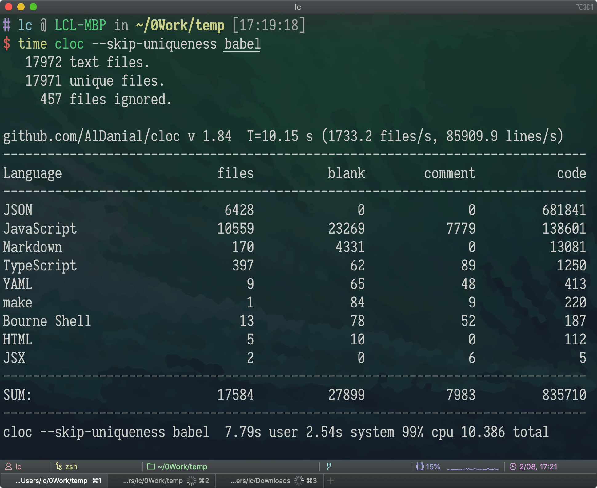
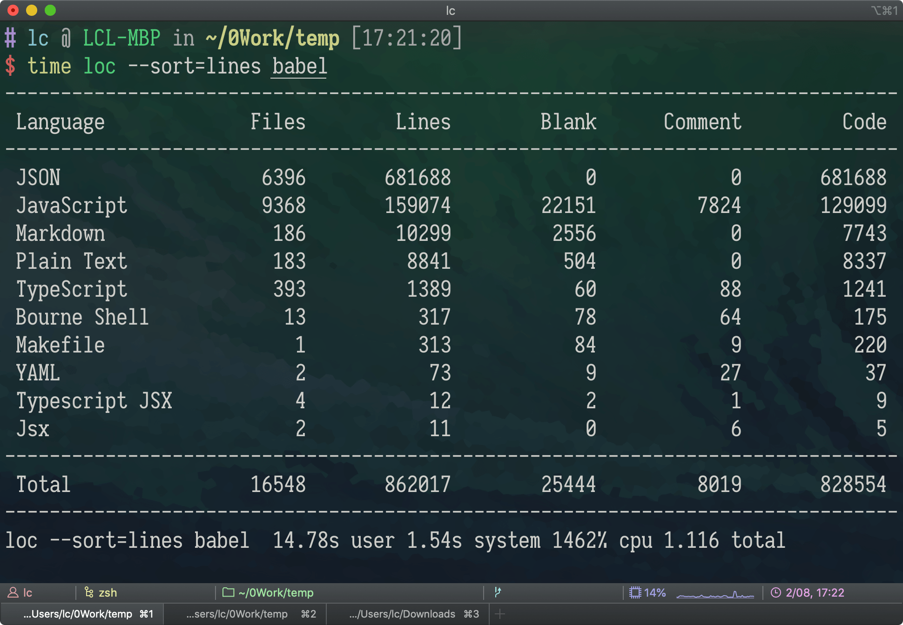
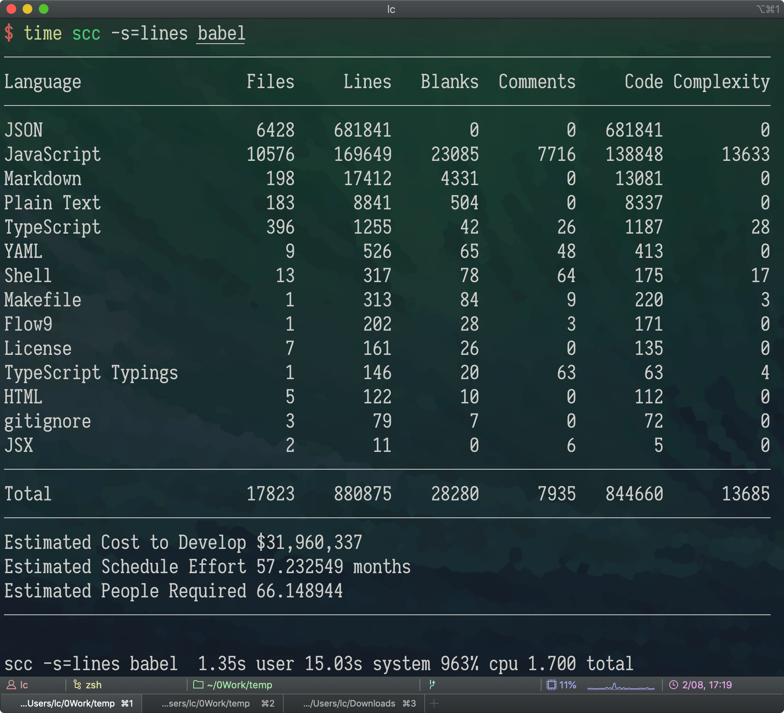
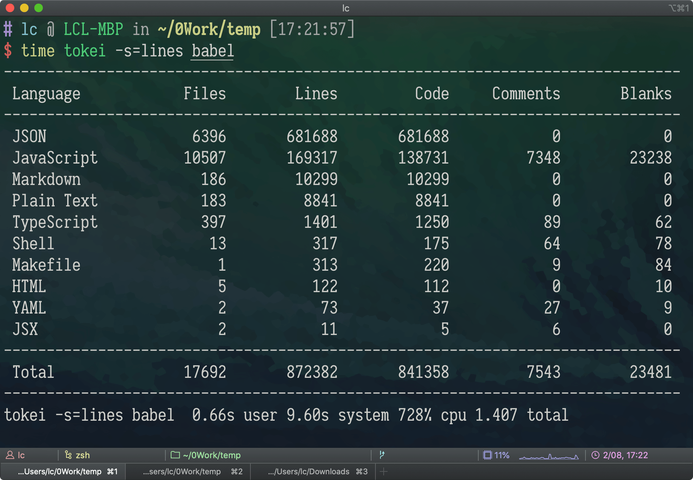

# 代码行数统计工具小测

## 背景

代码量统计可以量化地分析项目中的代码的情况。

我最早知道和使用的是 cloc，但是我一直不满意它的运行速度，  
可能小型项目没什么感觉，  
而我处理的项目源码有几十万行的代码量（排除 `node_modules`），  
统计一次需要稳定花费 20s……

虽然它的筛选功能很强大，但是实在是太慢了…  
后来我偶然间发现了其他同类工具，直接从 20s 来到 1s，  
太香了！

那这些工具有（按字典排序）：

- cloc: <https://github.com/AlDanial/cloc>
- loc: <https://github.com/cgag/loc>
- scc: <https://github.com/boyter/scc>
- tokei: <https://github.com/XAMPPRocky/tokei>

它们有各有差异，诸如：

- 对文件的默认排除（隐藏文件、`gitignore` 等）策略不同
- 对注释和空行的识别有差异
- 默认的排序项等等

但它们都支持一些基本的统计需求：

- 显示每个文件的独立分析
- 是否包含隐藏文件
- 包含/排除指定文件
- 结果按某列排序
- 总和

都是实用的工具。

## 简单测试对比

先来一些我发现的基本的纸面数据：

|       Repo       |     Star     |     更新     | 语言 | 功能\* | 默认排序 | 速度 |
| :--------------: | :----------: | :----------: | :--: | :----: | :------: | :--: |
|  [cloc][cloc-u]  | ![][cloc-s]  | ![][cloc-l]  | Perl |   84   | 代码行数 |  慢  |
|   [loc][loc-u]   |  ![][loc-s]  |  ![][loc-l]  | Rust |   6    | 代码行数 |  快  |
|   [scc][scc-u]   |  ![][scc-s]  |  ![][scc-l]  |  Go  |   29   | 文件数量 |  快  |
| [tokei][tokei-u] | ![][tokei-s] | ![][tokei-l] | Rust |   14   | 语言类型 |  快  |

[cloc-u]: https://github.com/AlDanial/cloc
[loc-u]: https://github.com/cgag/loc
[scc-u]: https://github.com/boyter/scc
[tokei-u]: https://github.com/XAMPPRocky/tokei

<!--  -->

[cloc-l]: https://img.shields.io/github/last-commit/AlDanial/cloc
[loc-l]: https://img.shields.io/github/last-commit/cgag/loc
[scc-l]: https://img.shields.io/github/last-commit/boyter/scc
[tokei-l]: https://img.shields.io/github/last-commit/XAMPPRocky/tokei

<!--  -->

[cloc-s]: https://img.shields.io/github/stars/AlDanial/cloc
[loc-s]: https://img.shields.io/github/stars/cgag/loc
[scc-s]: https://img.shields.io/github/stars/boyter/scc
[tokei-s]: https://img.shields.io/github/stars/XAMPPRocky/tokei

还有 tokei 自己做的性能对比：  
<https://github.com/XAMPPRocky/tokei/blob/master/COMPARISON.md>

> 注：功能的值来自除了 `help` 以外的参数个数，诸如：
>
> ```bash
> cloc --help | grep -v '\-\-help' | grep -E '^.{0,20}\-\-' | wc -l
> ```

可以看到 cloc 是 star 最多的，  
功能也是最丰富的，  
包括它的文档说明也是巨细无遗，  
（可惜它是真的慢……）

行叭，看看实际干活都怎么样。

先找一个巨型仓库：Babel、  
然后是规模小一点的：RxJS、  
最后自己新建了一些文件试试。

```bash
git clone --depth=1 https://github.com/babel/babel
git clone --depth=1 https://github.com/ReactiveX/rxjs
git clone --depth=1 https://github.com/seognil-study/cloc-playground
```

## 测试结果

直接用最大的 babel 来试试各个工具和结果如何：

> 注：`time` 是 mac 上统计运行时间用的，  
> 打印出来 `total` 左边的数字是实际运行秒数，比如：
>
> ```bash
> time sleep 1
> sleep 1  0.00s user 0.00s system 0% cpu 1.007 total
> ```

`time cloc --skip-uniqueness babel` ↓



`time loc --sort=lines babel` ↓



`time scc -s=lines babel` ↓



`time tokei -s=lines babel` ↓



## 小结

cloc 确实是最慢的，要花 10s 以上，  
（cloc 是否关闭去重功能，其实对速度的影响有限…）

而其他工具基本都在 1s 左右，  
这是对于 Babel 仓库 88MB、一万多个文件的情况，  
更小的项目只会更快。

另外可以注意到对文件识别上的差别：

- cloc 没有统计 Plain Text
- loc 将 `ts`/`tsx` 区分成了 `TypeScript`/`Typescript JSX`
- 各个工具找到的文件和统计也有差别

我手动 find 的文件数量：

`find babel -name "*.json" | wc -l`  
结果是 6428，和 `cloc`、`scc` 一致

`find babel -name "*.js" | wc -l`  
结果是 9436，和 `loc -uu` 一致

而诸如代码和注释，每个工具也有所差别，  
比如我发现 JSON 中的注释它们都是不支持的，

```json
{
  // 注释
  /**
   * 注释
   */
}
```

你说 JSON 不支持注释，为什么 JSON 里有注释？  
实际上在 VS Code 里支持一种语言类型叫 `JSON with Comments`，  
以下文件都支持 JSON + 注释而不会造成失效：

- VS Code 的 `settings.json`
- Prettier 的 `.prettierrc`
- TypeScript 的 `tsconfig.json`

所以统计差异可以理解，  
毕竟这些工具的代码也是人来维护的，  
不可能穷尽和覆盖世界上的所有语言。

`.jsx` 来自于 React，万一哪天出了 `.jsy`、`.jsz` 新 DSL 呢？  
还有 `.prettierrc` 是什么？（它们都识别不了）

实际上 `.prettierrc` 支持 JSON 或 YAML 的不同格式，  
然而如果还要解析语法，这就超出了简单的统计工具的能力范围了。

后续我可能会使用 scc，毕竟看上去统计的是最全的，数字是最多的（误  
而且开发复杂度和开发成本估计的功能挺有意思…
