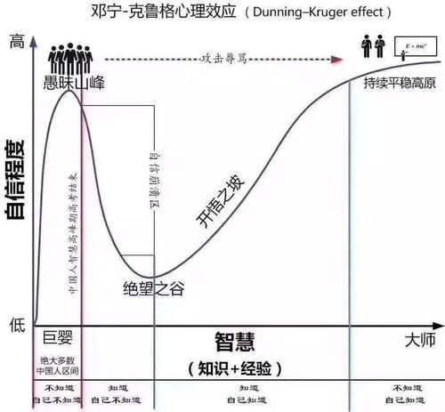
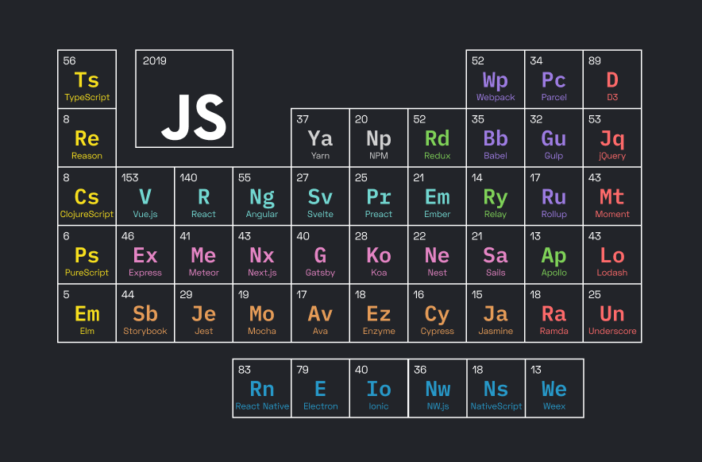
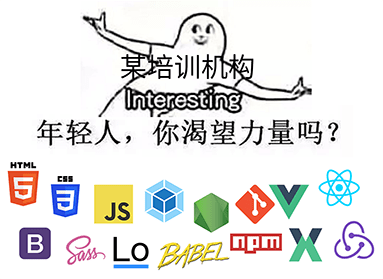

# 硬核前端（劝退篇）

## 当个前端工程师

### 这算是前端**工程师**吗？

你以为前端就是切图写页面吗？

你以为互联网行业有高工资，前端又好像门槛相对比较低，  
报了个培训班学了三个月，找到工作拿个十几 K 就喜大普奔吗？

你以为写了个仿饿了么、仿网易云、写了个轮播，  
学了下 React/Vue 用法（甚至还读了源码），  
就算前端入门了吗？就了解前端了吗？

不不不，这只是最初的阶段。

#### 那前端还能做些什么

[这个程序员写的免费在线 PS，让他三十岁前财务自由](https://zhuanlan.zhihu.com/p/70636726)

[拆解一款 Webgl 渲染器](https://zhuanlan.zhihu.com/p/28108991)

[从 VSCode 看大型 IDE 技术架构](https://zhuanlan.zhihu.com/p/96041706)

[页面可视化搭建工具前生今世](https://zhuanlan.zhihu.com/p/37171897)

#### 前端行业的近况

> 每 18 至 24 个月，前端都会难一倍。 —— 赫门 / 2015 “深 JS”大会

[在 2016 年学 JavaScript 是一种什么样的体验？](https://zhuanlan.zhihu.com/p/22782487)

> 在你学会一项前端技术的时候，另外三项新技术已经发布了。不仅如此，你刚学会的那个也已经被弃用了。  
> —— [[译] 为何前端开发如此不稳定](https://juejin.im/post/5b1f2f1ae51d4506894983ae)

[为什么很多技术都觉得前端很简单？](https://www.zhihu.com/question/353545736/answer/935917542)

[未来的前端工程师](https://juejin.im/post/5a474c8ff265da430a50ea57)

[给 2019 前端的 5 个建议](https://github.com/camsong/blog/issues/11)

[「2019 JSConf.Asia - 尤雨溪」在框架设计中寻求平衡](https://zhuanlan.zhihu.com/p/76622839)

[现代 Web 开发的现状与未来（JSDC 2019 演讲全文）](https://zhuanlan.zhihu.com/p/88616149)

[这些年的体验技术部 · 前端工程 - 与云共舞，未来已来](https://www.yuque.com/afx/about/basement)

[《蚂蚁前端研发最佳实践》文字稿](https://github.com/sorrycc/blog/issues/90)

[VS Code 成主宰、Vue 备受热捧！2019 前端开发趋势必读](https://zhuanlan.zhihu.com/p/97741102)

[2019 年 JavaScript 明星项目](https://risingstars.js.org/2019/zh)  
[2018 年 JavaScript 明星项目](https://risingstars.js.org/2018/zh)  
[The State of JavaScript 2019](https://2019.stateofjs.com/zh/)

### 所以，前端工程师是什么？

> 前端工程师首先是个程序员，其次也是个软件工程师。

前端工程师应该掌握扎实的 JS、CS 理论知识和编程功底。  
并将工作尽可能得工程化。

虚假的前端工程师：

真正的前端工程师：

#### 如何成为优秀的前端工程师

简单的道理：不会就学

并且要学习的是精华的、核心的、通用的、本质的部分，  
而不是 API 和用法的表皮。

> 众所周知，技术会过时。  
> 有的工作准入门槛低，但这不等于简单。  
> 你应该做的是去学习基本功。比如啥操作系统，算法，编程语言，体系结构这些。  
> —— [半衰期](https://zhuanlan.zhihu.com/p/84927997)

[打破框架的范式之争](https://zhuanlan.zhihu.com/p/82958907)

> 很多时候，人们排斥一个新技术，并不是因为新技术不好，而是这可能让自己多年精通的老手艺带来的 “竞争优势” 完全消失。可能一个织布老专家手工织布效率是入门学员的 5 倍，但换上织布机器后，这个差异很快会被抹平，老织布专家面临被淘汰的危机，所以维护这份老手艺就是维护他自己的利益。希望每个团队中的老织布工人都能主动引入织布机。  
> —— [精读《unstated 与 unstated-next 源码》](https://zhuanlan.zhihu.com/p/93500556)

## 小结

> 生产力决定生产关系：生产力对生产关系起着决定作用、支配作用，其主要表现在两个方面：第一，生产力的性质决定生产关系的性质。第二，生产力的发展变化决定生产关系的改变。  
> 生产关系反作用于生产力：这种反作用表现为两种情况：第一，适合生产力的性质和发展要求的先进的生产关系，促进生产力的发展；第二，不适合生产力的性质和发展要求的落后的生产关系，阻碍生产力的发展。  
> —— [马克思主义哲学](https://zh.wikipedia.org/wiki/%E5%8E%86%E5%8F%B2%E5%94%AF%E7%89%A9%E4%B8%BB%E4%B9%89)

> 通常来说，我们都会认为高工资来自于高技能。但从逻辑上来说，这是不对的。因为从经济学角度来说，高工资只能来自于高利润，这是一个很容易理解的收支平衡问题。  
> 而 IT 行业之所以能拥有高利润，是因为过去的这些年，IT 行业确实极大的促进了生产力的发展。所以，才会有高利润溢价推高程序员的工资。  
> —— [非程序员说编程有什么难的，作为程序员，该怎么回答这个问题？ - 沈世钧](https://www.zhihu.com/question/356294204/answer/935303946)

如果看完本文中的链接，你的感受是：

> 卧槽！这都什么东西？球球你们别学了，我跟不上了。

那么你**可能**不太适合这个行业，  
建议赶紧转行，找一份真正适合自己的工作，  
而不是强行进入这个行业，当个切图仔调包侠。  
然后过两三年才发现自己不适合这个工种，  
并且由于高深的技术又不会、搬砖又拼不过年轻人，只能被裁员这样子。  
（ 战 术 劝 退 ）

如果你的感受是：

> 卧槽！爽文！搞技术太酷了！打开了新世界！我来！

那么恭喜，说明你有一定的技术储备和技术思维，  
并且拥有相当的技术热情，你**可能**非常有机会！  
欢迎你！期待你能创造更多价值！
