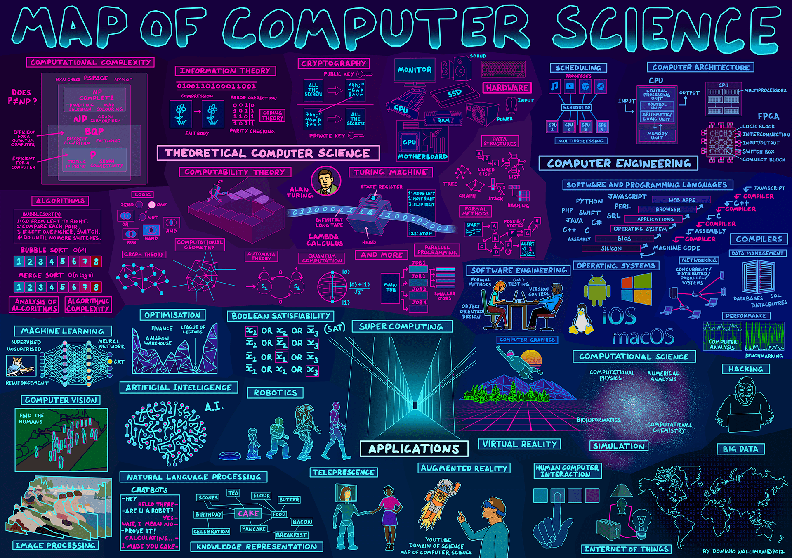

# 计算机科学 入门指南

## 计算机科学 简介

### 什么是 计算机科学

> 计算机科学（英语：Computer Science，有时缩写为 CS）是系统性研究信息与计算的理论基础以及它们在计算机系统中如何实现与应用的实用技术的学科。

### 为什么要学习 计算机科学

- 如果你想从事开发工作并作为自己的长期事业
- 如果你并非从事开发行业，但是想写一点小脚本提高自己的工作效率
- 如果你想了解计算机、程序、代码是如何工作的

就像造汽车需要了解物理化学，  
写代码需要了解一定的 CS 体系知识。

引用知乎 [Matrix 67 的数学水平怎么样？](https://www.zhihu.com/question/20823906) 问题中答案的句子。

> 数学是一门现代化的学问，这就是说，一个人再有天赋再有品味再有美感（其实我都不知道这些大词到底是在说啥但是很多人一提到数学就喜欢说这个），他也得老老实实地去念书，去做题，去看论文写论文，才配称为一个数学家。

可以类比的：

> 编程是一门现代化的学问，这就是说，一个人再有天赋再有品味再有美感，他也得老老实实地去念书（CS），去写代码，去看源码写程式，才配称为一个工程师。

#### 前端开发 和 计算机科学

为什么前端开发需要学习计算机科学，  
简单的道理：不学你就不会。  
（想象一下要做 Google Docs 或 VS Code 这样规模的 **Web 软件**）

Stanford 的 Programming Methodology 中做了一个类比：

如果你懂英语，那你可以听说读写，  
但是如果你要写一本书，那完全是另一个领域的事情。  
因为书可以用英语写，也可以用汉语日语俄语德语写。  
自然语言仅仅是写书所用的工具之一。

写作中的措辞段落章节排版等等，都是语言无关的，仅仅和写作自身有关。

同样的道理：  
会写 JS/React/Vue 是一回事，能写一个完整的项目又是一回事，  
能通过**多人协作**以**工程化**的方式**高效**地**实现和维护**一个的**大型**的**软件**项目，  
那和仅仅掌握语言或框架完全不是一个层次的事情了。

## 入门 计算机科学

CS 是一个很大的体系，不然也不可能在高校中专门开设一个专业。

无论目标是**从事开发工作**还是**满足自己的好奇心**，  
无论是**科班的新生**还是**跨专业的初学者**，

在**入门阶段**，首先要了解的不是具体的工程技能，  
而是导论：了解 CS 学科体系的全貌和大致分支。  
以便为之后的学习和开发工作指明方向。

之后再根据需要，深入学习具体的分支即可。

### 概览

- 耗时：
  - CCCS 系列视频总长大约 7 个小时
  - （CS50 系列视频总长大约 18 个小时）
  - 额外的学习和理解控制在 20~40 个小时内（先入门）
- 难点：
  - 建立思维模式和知识体系
  - 给学习划分重要性和优先级
- 工具：
  - 一台电脑
  - 稳定的网络

### 学习路线

- 前置学习
  - [学习方法论](/study/crash-course-study-skills)
  - [英语 训练指南（编程篇）](/study/using-english)
- 入门 CS
  - 学习 CCCS 系列视频
  - 建立自己的 CS 知识体系
- 下一步
  - （前端）[学习 JavaScript](/frontend/javascript-foundation) （或其他你想从事的领域的基本编程语言）
  - 深入学习 CS 的各个子学科
- 进阶
  - 学习 CS50 系列视频（入门课程）
  - 《深入理解计算机系统》（CSAPP）
- 迷思
  - 记得自己记录

## 资料

### 自学教材

- 概览
  - Map of Computer Science
    - [Map of Computer Science](https://www.youtube.com/watch?v=SzJ46YA_RaA)：11 分钟
    - [图解计算机科学](https://www.bilibili.com/video/BV1TJ411a7uo)
  - [How do computers read code?](https://www.youtube.com/watch?v=QXjU9qTsYCc)：12 分钟
  - [如何自学编程？](https://www.zhihu.com/lives/860490807847841792)：110 分钟
  - [如何自学计算机专业课程？](https://www.zhihu.com/lives/837669764146003968)：106 分钟
- 视频教程（系列）
  - CCCS
    - [Crash Course Computer Science - YouTube](https://www.youtube.com/watch?v=tpIctyqH29Q&list=PL8dPuuaLjXtNlUrzyH5r6jN9ulIgZBpdo)
    - [计算机科学速成课 - bilibili](https://www.bilibili.com/video/av21376839/)
  - CS50
    - CS50 2019
      - [CS50 Lectures 2019](https://www.youtube.com/playlist?list=PLhQjrBD2T381L3iZyDTxRwOBuUt6m1FnW)
      - [哈佛公开课 CS50 2019 - David J. Malan【九集全】【中英字幕】](https://www.bilibili.com/video/BV1MJ411V73c)
    - CS50 Walkthroughs 2019
      - [CS50 Walkthroughs 2019](https://www.youtube.com/playlist?list=PLhQjrBD2T381AUFv2ZbwN9wM0pkNy-uHa)
      - [哈佛公开课 CS50 Walkthroughs 2019 【演练讲解】【中英字幕】](https://www.bilibili.com/video/BV147411k7Kc)
    - CS50 Shorts
      - [CS50 Shorts](https://www.youtube.com/playlist?list=PLhQjrBD2T381k8ul4WQ8SQ165XqY149WW)
      - [哈佛公开课 CS50 Shorts - Doug Bloyd【短片 50】【中英字幕】](https://www.bilibili.com/video/BV1m7411c7fF)
    - CS50 Beyond 2019
      - [CS50 Beyond 2019](https://www.youtube.com/playlist?list=PLhQjrBD2T381Q6R1jRxgXknYO7VuTYPBI)
      - [哈佛公开课 CS50 Beyond 2019【网页前端开发】【中英字幕】](https://www.bilibili.com/video/BV1K7411q7Dd)
    - CS50's Web Programming with Python and JavaScript
      - [CS50's Web Programming with Python and JavaScript](https://www.youtube.com/playlist?list=PLhQjrBD2T382hIW-IsOVuXP1uMzEvmcE5)
      - [[双字]CS50's Web Programming with Python and JavaScript](https://www.bilibili.com/video/BV12741187gA)
    - CS50 2018
      - [CS50 Lectures 2018 - YouTube](https://www.youtube.com/watch?v=5azaK2cBKGw&list=PLhQjrBD2T382eX9-tF75Wa4lmlC7sxNDH&index=2)
      - [CS50 Lectures 2018 - bilibili](https://www.bilibili.com/video/av45936507)
    - CS50's Understanding Technology 2017
      - [CS50's Understanding Technology 2017](https://www.youtube.com/playlist?list=PLhQjrBD2T382p8amnvUp1rws1p7n7gJ2p)
      - [计算机入门 - CS50 - 理解技术 - David J. Malan 【六集全】【中英字幕】](https://www.bilibili.com/video/BV1sJ41147Vu)
- 知识体系 
  - [[译] Coding Interview University 一套完整的学习手册帮助自己准备 Google 的面试](https://github.com/jwasham/coding-interview-university/blob/master/translations/README-cn.md)
  - [系统设计入门](https://github.com/donnemartin/system-design-primer/blob/master/README-zh-Hans.md)
  - Teach Yourself Computer Science
    - [Teach Yourself Computer Science](https://teachyourselfcs.com/)
    - [自学计算机科学](https://github.com/keithnull/TeachYourselfCS-CN/blob/master/TeachYourselfCS-CN.md)
  - [MIT Challenge](https://www.scotthyoung.com/blog/myprojects/mit-challenge-2/)
- 进阶书籍
  - [深入理解计算机系统](https://book.douban.com/subject/26912767/)（CSAPP）
  - [计算机程序的构造和解释](https://book.douban.com/subject/1148282/)（SICP）

### 编程漫谈

- [为什么滑铁卢大学让大一学生从不实用的 racket 语言学起而不是直接上手 C 语言？](https://www.zhihu.com/question/348189701)
- [如何掌握所有的程序语言](http://www.yinwang.org/blog-cn/2017/07/06/master-pl)
- [如何评价王垠新博文《如何掌握所有的程序语言》？](https://www.zhihu.com/question/62097662)
- [编程究竟难在哪？](https://www.zhihu.com/question/311432227)
- [编程到底难在哪里？](https://www.zhihu.com/question/22508677)
- [把代码写的太灵活不好吗？为什么会被上司批评？](https://www.zhihu.com/question/52951851)
- [为何部分程序员从不使用 break 或 continue 语句？](https://www.zhihu.com/question/334216911)
- [「低耦合，高内聚」真的好吗？](https://www.zhihu.com/question/347264877/answer/834666851)

* Devon Crawford
  - [3 years of Computer Science in 8 minutes](https://www.youtube.com/watch?v=ReVeUvwTGdU)：8 分钟
    - 3 年 CS 学习经历，基本编程（Java），底层语言（C），数据结构（C），汇编，二进制加法，数字电路
  - [Day in the Life of a Computer Science Student | UoG](https://www.youtube.com/watch?v=iURPY28jOD4)：6 分钟
    - CS 学生的一天，课程，作业，算法
  - [Hardest Computer Science Course Explained | Angel of Death UoG](https://www.youtube.com/watch?v=S20NcDLF_t4)：8 分钟
    - 一个作业（解析一个文件），C、JS、Web Server、MySQL
  - [Why I'm not in School](https://www.youtube.com/watch?v=eDjGBOxuuZs)
    - Gap Year 的两周，Container，K8s，Home Router

- ["Uncle" Bob Martin - "The Future of Programming"](https://www.youtube.com/watch?v=ecIWPzGEbFc)
- Teach Yourself Programming in Ten Years
  - [Teach Yourself Programming in Ten Years](https://norvig.com/21-days.html)
  - [十年学会编程](https://liuyandong.com/2017/10/25/122/)

### 中国高校 CS 课程体系

- [顶尖中文大学计算机专业课程体系 - 网易云课堂](https://study.163.com/curricula/cs.htm)

* [清华大学计算机系课程攻略](https://github.com/PKUanonym/REKCARC-TSC-UHT)
* [北京大学信息学院计算机系 本科&研究生课程大作业选集](https://github.com/tongtzeho/PKUCourse)
* [libpku - 贵校课程资料民间整理](https://github.com/lib-pku/libpku)
* [上海交通大学课程分享](https://github.com/CoolPhilChen/SJTU-Courses)
* [浙江大学课程攻略共享计划](https://github.com/QSCTech/zju-icicles)
* [中国科学技术大学课程资源](https://github.com/USTC-Resource/USTC-Course)

## CS 知识体系

### 视频小结

- [Map of Computer Science](https://www.youtube.com/watch?v=SzJ46YA_RaA)：11 分钟
  - **CS 理论**：阿兰图灵，图灵机，通用计算机，RAM，CPU，硬件，Lambda 演算，可计算性理论，停机问题，计算复杂度，P/NP，算法，信息论，计算理论，密码学，逻辑门，图论，计算几何，自动机理论，量子计算，并行计算，形式化方法，数据结构
  - **计算机工程**：队列，多进程，计算机架构，FPGA，软件和编程语言，编译器，操作系统，软件工程，网络，数据管理，性能，图形学
  - **应用**：优化，布尔可满足性问题，人工智能，机器学习，计算机视觉，图像处理，自然语言处理，知识表示，大数据，物联网，黑客，计算科学，超算，人机交互，VR/AR，远程呈现，机器人学

- [How do computers read code?](https://www.youtube.com/watch?v=QXjU9qTsYCc)：12 分钟
  - 编译器
  - 源文件，字节码，中间码，机器码，可执行文件，二进制指令
  - 词法分析（Lexical），语法分析（Syntactic），语义分析（Semantic），Token，分析树
  - 汇编，if，函数
  - 语法高亮，静态分析，OO，FP，库，链接器，构建工具，Debugger

### CCCS 视频小结

- 核心概念
  - 抽象、封装、分治
  - 复杂度 vs 速度

* **计算机历史** 【1~2, 24~25】
  - 【1 计算工具发展史】
  - 【2 电子计算机发展史】继电器（relay）、BUG、真空管、晶体管
  - 【24 战争和商业对技术的推动】
  - 【25 个人计算机】
* **计算机组成** 【3~9】
  - 【3 布尔逻辑】 布尔、逻辑电路、逻辑门、二进制
  - 【4 二进制】二进制和编码
  - 【5 ALU】ALU（算数逻辑单元）
  - 【6 内存】锁存器、寄存器、内存
  - 【7 CPU】寄存器 + 控制器 + ALU => CPU、时脈、超频、时钟周期
  - 【8 指令和程序】指令、指令集
  - 【9 高级 CPU 设计】硬件加速、CPU 缓存、总线、内存一致性、CPU 流水线、乱序执行、分支预测、多发射
* **编程** 【10~16】
  - 【10 早期编程】打孔纸带、patch（补丁）、插线板、Console、冯诺依曼结构
  - 【11 编程语言】伪代码、机器码、汇编、编译器、程序语言设计
  - 【12 语言特性】语句、语法、变量、控制流、函数、模块化、库
  - 【13 算法】复杂度、大 O 表示法
  - 【14 数据结构】数组、字符串、结构体、链表、队列、栈、树、图、堆
  - 【15 图灵】可判定性问题、Lambda 算子、图灵机、图灵完备、停机问题、图灵测试
  - 【16 软件工程】面向对象编程、API、IDE、README、版本控制、QA
* **半导体工业** 【17】
  - 【17 集成电路】集成电路（IC）、PCB、晶圆、光刻、摩尔定律、量子隧穿
* **近代计算机** 【18~23, 26~27】
  - 【18 操作系统】操作系统（OS）、设备驱动、多任务、分时系统、虚拟内存、内存保护、内核
  - 【19 存储】磁存储器、磁带、磁盘、存储层次体系、光盘、SSD
  - 【20 文件系统】文件格式、文件头、元数据、目录、磁盘碎片、分层文件系统
  - 【21 压缩】游程编码、无损压缩、哈夫曼编码、感知编码
  - 【22 命令行界面】人机交互、命令行界面（CLI）、键盘、打字机、终端
  - 【23 屏幕】CRT、LCD、ASCII、矢量图、位图
  - 【26 图形用户界面】图形用户界面（GUI）、鼠标、DEMO、窗口、桌面、事件驱动编程、WYSIWYG
* **图形学** 【27】
  - 【27 图形学】线框渲染、投影、polygon（多边形）、mesh（网格）、减面、扫描线算法、AA（抗锯齿）、画家算法、深度缓冲、z-fighting、背面剔除、Shading（着色）、法线、纹理
* **计算机网络** 【28~30】
  - 【28 计算机网络】LAN（局域网）、MAC 地址、以太网、载波侦听多路访问（CSMA）、带宽、指数退避、交换机、互联网、路由、报文、跳数、packet（数据包）、IP 地址、拥塞控制、TCP/IP、分组交换、ICMP、BGP、IoT
  - 【29 互联网】互联网（Internet）、LAN（局域网）、ISP（互联网服务提供商）、WAN（广域网）、骨干网、traceroute、IP、端口、UDP、TCP、DNS、顶级域名（TLD）、OSI 模型（七层）
  - 【30 万维网】WWW（万维网）、URL、HTTP、状态码、HTML、CSS、JavaScript、浏览器、搜索引擎、backlink、网络中立性
* **计算机安全** 【31~33】
  - 【31 计算机安全】保密性、完整性、可用性、威胁模型分析、身份认证、暴力攻击、两步验证、访问控制、BLP 模型、可信计算、形式化验证、isolation（隔离）、sandbox（沙盒）、虚拟机
  - 【32 黑客和攻击】黑客、白帽子、网络犯罪、社会工程学、钓鱼、电话诈骗、恶意软件、缓冲区溢出、SQL 注入、零日漏洞、僵尸网络、DDOS
  - 【33 密码学】替换加密、移位加密、DES、AES、DH 密钥交换算法、对称加密、非对称加密、RSA
* **新产业**【34~40】
  - 【34 人工智能】ML（机器学习）、AI（人工智能）、分类器、决策树、支持向量机、深度神经网络、强 AI、强化学习（RL）
  - 【35 计算机视觉】边缘检测、kernal（线性算子）、卷积神经网络、人脸识别
  - 【36 自然语言处理】NLP（自然语言处理）、分词、知识图谱、语音识别、FFT（快速傅里叶变换）
  - 【37 机器人】robot、CNC、PID 控制器、无人驾驶、机器人三定律、机器人伦理
  - 【38 计算机心理学】Usability、视觉感知、分块、affordance（示能性）、情感计算、人机交互（HRI）、恐怖谷
  - 【39 教育科技】维基、教学视频、MOOC、领域模型、贝叶斯知识追踪
  - 【40 未来】普适计算、奇点、技术性失业、cyborg、数字永生、VR、可穿戴设备、虚拟助手、加密货币、无线通讯、3D 打印、生物信息学、量子计算

### 本科 CS 基本课程

- CS
  - 计算机导论
  - 计算机组成原理
  - C/C++/Java/Python 语言
  - 算法与数据结构
  - 软件工程
  - 编译原理
  - 操作系统
  - 计算机网络
- EE
  - 数字电路、模拟电路
  - 信号处理
- 杂项
  - （数学/物理相关）
  - 编程范式
  - 设计模式
  - 系统设计

### 前端中的 CS

早期前端野蛮生长，现代前端需要 CS。  
在**生产力提高**和**行业需求升级**的相互作用下，  
前端工作中的各部分都多少涉及 CS 的各个子领域，  
举例说明：

- 编译原理：Babel、TypeScript、JSX、Sass/LESS
- 软件工程：Webpack、CI/CD、单元测试
- 设计模式：框架（MVVM、依赖注入）、网站架构设计、KOA（AOP 编程）
- 图形学：WebGL、three.js
- 安全：HTTPS、权限、XSS、CSRF、输入验证
- 编程范式：Ramda（函数式）、RxJS（响应式）
- 算法和数据结构：Immutable、React fiber、diff、Lodash
- 计算机网络：HTTP、状态码
