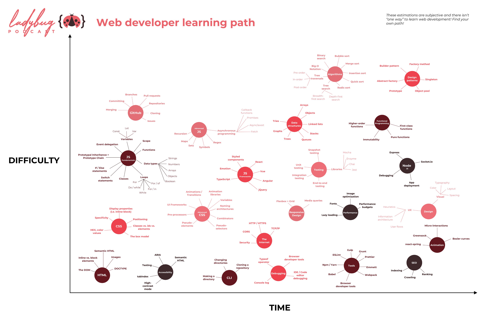

# 前端开发入门指南 \*

\* 撰写中

> 从野路子入门到系统性~~精通~~略懂

（2019~2020）

[关于本站](./readme.md)

- **杂谈**：我的关于学习的一些粗浅理解（鸡汤）
  - [我的阅读](./my-reading.md)
  - [为什么要学习](./study-the-only-way.md)
  - [关于学习的鸡汤](./study-fortune.md)
  - [培训机构的局限性](./study-the-costly-way.md)
  - [关于学习指南系列](./about-the-guild.md)
  - [学习指南模板](./study-guild-abstraction.md)

## 前端开发路线图（收集的）

- **前端开发概览**
  - 视频
    - [Web Development In 2020 - A Practical Guide](https://www.youtube.com/watch?v=0pThnRneDjw)：72 分钟，概览指南
  - CheckList
    - [前端九部 - 入门者手册 2019](https://www.yuque.com/fe9/basic)：系列文章
    - [【自检】前端知识清单](http://www.conardli.top/blog/article/%E7%BB%BC%E5%90%88/%E3%80%90%E8%87%AA%E6%A3%80%E3%80%91%E5%89%8D%E7%AB%AF%E7%9F%A5%E8%AF%86%E6%B8%85%E5%8D%95.html)
- **JavaScript 及框架类库学习教程**
  - [JavaScript Tutorials - freeCodeCamp.org](https://www.youtube.com/playlist?list=PLWKjhJtqVAbleDe3_ZA8h3AO2rXar-q2V)：系列视频教程
  - [Web Development Crash Courses - Traversy Media](https://www.youtube.com/playlist?list=PLillGF-RfqbYeckUaD1z6nviTp31GLTH8)：系列视频教程
- **前端工具生态概览**
  - [2019 年 JavaScript 明星项目](https://risingstars.js.org/2019/zh)：JS 项目流行度统计
  - [The State of JavaScript 2019](https://2019.stateofjs.com/zh/)：前端开发习惯调查

### Front-end Developer Handbook

> [Front-end Developer Handbook 2019](https://frontendmasters.com/books/front-end-handbook/2019/)  
> [前端开发者手册 2019](https://yylifen.github.io/front-end-handbook-2019/index.html)：汉化版

### WEB DEVELOPER ROADMAP

> [在 2020 年成为一个 Web 开发者](https://github.com/seognil/developer-roadmap-chinese-simplified)：我翻译的简中汉化版  
> [WEB DEVELOPER ROADMAP - 2020](https://github.com/kamranahmedse/developer-roadmap)：Web 开发者学习路线图  
> [2019 年成為 Web 開發人員的路線圖](https://github.com/goodjack/developer-roadmap-chinese)：繁中汉化版

### Web Developer Learning Path

> [Ladybug Podcast](https://twitter.com/LadybugPodcast/status/1247051343212281856)

## 前端开发路线图（我写的）

### 编程入门和开发环境准备

- **铺垫学习**
  - [硬核前端（劝退篇）](./fe-hardcore-overview.md)：了解现代前端开发的概况
  - [学习方法论](./study-methodology.md)：打造自己的知识管理体系
  - [英语 训练指南（编程篇）](./english-using.md)：打造英语使用环境
  - [计算机科学 入门指南](./computer-science.md)：了解计算机原理和编程思想

* **开发环境**：配置一套开发环境，准备学习前端开发
  - 魔法丝袜之影（略）：保障稳定的网络
  - [装了啥](./my-workstation.md)
  - [命令行 简介](./terminal-intro.md)：了解命令行（前端开发的重要组成部分）
  - [打造趁手的终端](./terminal-config.md)：配置命令行
  - [Mac、设置和软件](./mac.md)：调一下系统，装一些工具
  - [关于 Chrome](./chrome.md)：装个浏览器和插件
  - [关于 VS Code](./vscode.md)：装个代码编辑器和扩展
  - [用快捷键控制视频播放](./video-hotkey.md)：增强学习体验

### 前端开发入门

（学习前端开发除 JS 以外的部分，JS 单独成节，因为内容实在太多了…）

- **铺垫学习**
  - [Markdown 学习指南](./markdown.md)：学习写文档用的标记语言
  - [Git 学习指南](./git.md)：学习版本管理和周边概念
  - [Node 概览（先行版）](./npm-overview.md)：了解 Node.js（前端开发的重要组成部分）
  - [进一步提高 npm 安装速度（Proxy）](./npm-speedup.md)：npm 配置调优
  - [关于 Chrome](./chrome.md)：学习浏览器调试
  - [关于 VS Code](./vscode.md)：学习使用代码编辑器
- **前端相关**
  - HTML5
    - 基本 HTML 元素和属性
  - CSS
    - 基本 CSS 模型和属性
    - 响应式布局
    - Less/Sass 预处理
    - 动画及性能优化
  - [JavaScript ↓](#javascript-%e7%94%9f%e6%80%81%e8%b7%af%e7%ba%bf%e5%9b%be)
- **后端相关**
  - 计算机网络
  - 简单后端开发（Node.js）

### JavaScript 生态路线图

- [JavaScript 学习指南（系列）](./js-foundation.md)：了解 JavaScript 语言特性
- [TypeScript 学习指南](./typescript.md)：JavaScript + 静态类型系统
- **框架类库**
  - Vue/React：国内主流的两大 UI 框架
    - 组件渲染（[React Hooks 学习指南](./react-hooks.md)）
    - 状态管理方案（[Redux 学习指南](./redux.md)）
    - Router
    - （生态中的相关辅助工具或衍生框架）
  - Svelte：新一代 UI 框架（编译器）
  - GraphQL
- **工程**
  - 打包（[webpack-starter](https://github.com/seognil-lab/webpack-starter)）
  - npm 组件开发（[lib-starter](https://github.com/seognil-lab/lib-starter)）
  - 静态检查/编码规范
  - 自动化测试
    - 单元测试（[Jest 学习指南](./jest.md)）
    - UI 测试（[testing-library 学习指南](./testing-library.md)）
    - E2E 测试（[Cypress 学习指南](./cypress.md)）
  - 持续集成
  - （静态）部署
  - 性能优化
- **套路**
  - 算法和数据结构
  - **编程范式**
    - 面向对象编程
    - [函数式编程 入门指南](./functional-programming.md)
    - 响应式编程
    - 流式编程（[RxJS 学习指南](./rxjs.md)）
    - 面向切面编程
  - **程序设计**
    - 设计原则
    - 设计模式
      - GoF 设计模式
      - 函数式设计模式
      - （游戏设计模式）
      - 依赖注入
    - 架构模式
      - MVC、MVP、MVVM
  - 软件工程
- **特化**
  - BFF（Backends For Frontends）
  - SSR（Server-Side Rendering）
  - PWA（Progressive Web App）
  - 微前端（Micro Frontend Architecture）
  - WebGL
  - WebAssembly

* **框架技术**扩展阅读
  - [TodoMVC](http://todomvc.com/)
  - [Vue.js 技术揭秘](https://ustbhuangyi.github.io/vue-analysis/)
  - [vue-cli 源码分析](https://kuangpf.com/vue-cli-analysis/)
  - [Evan You on Vue.js: Seeking the Balance in Framework Design | JSConf.Asia 2019](https://www.youtube.com/watch?v=ANtSWq-zI0s)
  - [React 模式](https://github.com/SangKa/react-in-patterns-cn)
  - [React 源码解析](https://github.com/KieSun/react-interpretation)
  - [深入浅出 Webpack](https://webpack.wuhaolin.cn/)
  - [[webpack]源码解读：命令行输入 webpack 的时候都发生了什么？](https://github.com/DDFE/DDFE-blog/issues/12)

## 小结

以上这么多内容仅仅只涉及了前端开发的技术储备部分。

对于实际的业务和代码产出，还有无数细节和额外的套路，  
例如：兼容性、骨架屏、小程序、动画、表单、i18n、同构…

不过当你的技能体系能覆盖以上至少一半内容时，  
那么你已经是一个不错的工程师了 :)  
你可以自己发现的未来道路，加油 (•̀ᴗ•́)و ̑̑
