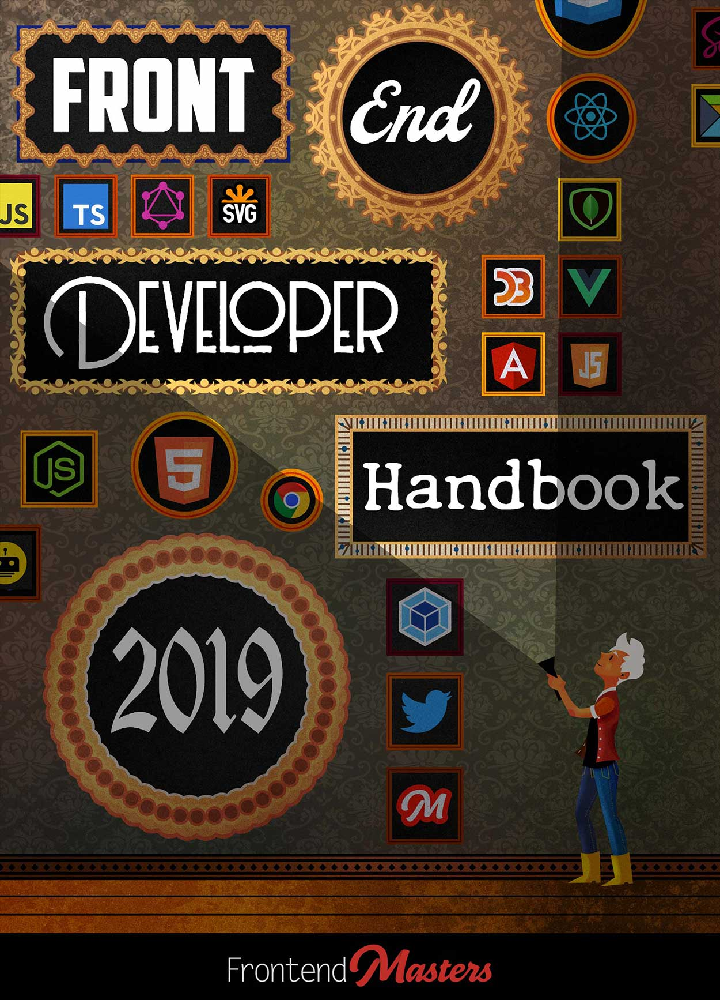
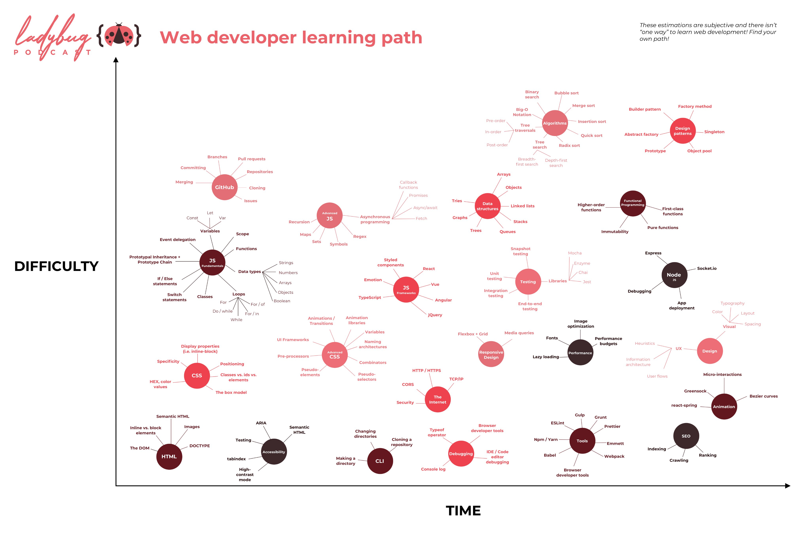

# 前端开发入门指南 （2019-2021）\*

\* 撰写中

> 从野路子入门到系统性~~精通~~略懂

[关于本站](/about/the-site)

- **杂谈**：我的关于学习的一些粗浅理解（鸡汤）
  - [我都从哪学习](/about/where-do-i-learn-from)
  - [为什么要学习](/study/study-the-only-way)
  - [关于学习的鸡汤](/study/study-fortune)
  - [培训机构的局限性](/study/study-the-costly-way)
  - [关于学习指南系列](/about/the-guild)
  - [学习指南模板](/study/study-guild-abstraction)

## 前端开发路线图（收集）

- **前端开发概览**
  - 视频
    - [Web Development In 2021 - A Practical Guide](https://www.youtube.com/watch?v=VfGW0Qiy2I0)：75 分钟，概览指南
  - CheckList
    - [前端九部 - 入门者手册 2019](https://www.yuque.com/fe9/basic)：系列文章
    - [【自检】前端知识清单](http://www.conardli.top/blog/article/%E7%BB%BC%E5%90%88/%E3%80%90%E8%87%AA%E6%A3%80%E3%80%91%E5%89%8D%E7%AB%AF%E7%9F%A5%E8%AF%86%E6%B8%85%E5%8D%95.html)
- **JavaScript 及框架类库学习教程**
  - [JavaScript Tutorials - freeCodeCamp.org](https://www.youtube.com/playlist?list=PLWKjhJtqVAbleDe3_ZA8h3AO2rXar-q2V)：系列视频教程
  - [Web Development Crash Courses - Traversy Media](https://www.youtube.com/playlist?list=PLillGF-RfqbYeckUaD1z6nviTp31GLTH8)：系列视频教程
- **上一年的前端生态小结**
  - [2020 年 JavaScript 明星项目](https://risingstars.js.org/2020/zh)：JS 项目流行度统计
  - [The State of JavaScript 2020](https://2020.stateofjs.com/zh-Hans/)：前端开发习惯调查

### Front-end Developer Handbook (2019)

> [Front-end Developer Handbook 2019](https://frontendmasters.com/books/front-end-handbook/2019/)  
> [前端开发者手册 2019](https://yylifen.github.io/front-end-handbook-2019/index.html)：汉化版

### WEB DEVELOPER ROADMAP

- Web 开发者学习路线图 2021
  - [原版](https://github.com/kamranahmedse/developer-roadmap)
  - [简体中文汉化](https://github.com/kamranahmedse/developer-roadmap/tree/master/translations/chinese)

### Web Developer Learning Path

> [Ladybug Podcast](https://twitter.com/LadybugPodcast/status/1247051343212281856)

### Phodal

- <https://github.com/phodal>
  - [Phodal's Idea 实战指南](http://ideabook.phodal.com/)
  - [GitHub 漫游指南](http://github.phodal.com/)
  - [Growth - an app to help you Be Awesome Developer](http://growth.ren/)
  - [Growth: 全栈增长工程师指南](https://growth.phodal.com/)
  - [Growth: 全栈增长工程师实战](http://growth-in-action.phodal.com/)
  - [RePractise](http://repractise.phodal.com/)
  - [我的职业是前端工程师](https://ued.party/)
  - [Serverless 应用开发指南](http://serverless.ink/)
  - [写给软件工程师看的硬件编程指南](https://phodal.github.io/make/)
  - [Thinking in Microfrontend (微前端的那些事儿)](https://microfrontends.cn/)
  - [系统重构与迁移指南](https://migration.ink/)
  - [Developer 进阶书单](https://phodal.github.io/booktree/)

## 前端开发路线图（我写的）

### 编程入门和开发环境准备

- **铺垫学习**
  - [硬核前端（劝退篇）](/frontend/frontend-hardcore-overview)：了解现代前端开发的概况
  - [学习方法论](/study/crash-course-study-skills)：打造自己的知识管理体系
  - [英语 训练指南（编程篇）](/study/using-english)：打造英语使用环境
  - [计算机科学 入门指南](/cs/crash-course-computer-science)：了解计算机原理和编程思想

* **开发环境**：配置一套开发环境，准备学习前端开发
  - 魔法丝袜之影（略）：保障稳定的网络
  - [装了啥](/workspace/awesome-tools)
  - [命令行 简介](/workspace/introduction-to-terminal)：了解命令行（前端开发的重要组成部分）
  - [打造趁手的终端](/workspace/terminal-settings)：配置命令行
  - [Mac、设置和软件](/workspace/mac)：调一下系统，装一些工具
  - [关于 Chrome](/workspace/chrome)：装个浏览器和插件
  - [关于 VS Code](/workspace/vscode)：装个代码编辑器和扩展
  - [用快捷键控制视频播放](/workspace/my-video-player-shortcuts)：增强学习体验

### 前端开发基本入门

（学习前端开发除 JS 以外的部分，JS 单独成节，因为内容实在太多了…）

- **铺垫学习**
  - [Markdown 学习指南](/cs/markdown)：学习写文档用的标记语言
  - [Git 学习指南](/cs/git)：学习版本管理和周边概念
  - [关于 Chrome](/workspace/chrome)：学习浏览器调试
  - [关于 VS Code](/workspace/vscode)：学习使用代码编辑器
- **前端相关**
  - [HTML5](/frontend/html)
  - [CSS](/frontend/css)
  - [JavaScript ↓](#js-roadmap)
- **后端相关**
  - 计算机网络
  - 简单后端开发（Node.js）

### JavaScript 生态路线图 {#js-roadmap}

- [JavaScript 语言（系列）](/frontend/javascript-foundation)：了解 JavaScript 语言特性
- [Node.js 和 NPM（系列）](/frontend/nodejs-basic)：了解 JavaScript 的一个 Runtime
- [TypeScript 学习指南](/cs/typescript-language-basic)：JavaScript + 静态类型系统
- **视图层框架**
  - React/Vue：国内主流的两大 UI 框架
    - 组件渲染（[React Hooks 学习指南](/frontend/react-hooks)）
    - 其他状态管理方案
      - [Redux 学习指南](/frontend/redux)
      - Mobx
      - Recoil
    - Router
    - （生态中的相关辅助工具或衍生框架）
  - Preact：React 的 lite 版
  - Svelte：（编译器框架）
- **项目和工程**
  - 打包工具
    - Webpack：[webpack-playground](https://github.com/seognil-study/webpack-playground)
    - [Vite](https://cn.vitejs.dev/)
  - ESLint：代码质量检查
  - Prettier：代码格式化
  - 自动化测试
    - 单元测试（[Jest 学习指南](/frontend/jest)）
    - UI 测试（[testing-library 学习指南](/frontend/testing-library)）
    - E2E 测试（[Cypress 学习指南](/frontend/cypress)）
  - CI
    - Github Actions
  - 部署
    - Vercel/Netlify/Cloudflare Pages
  - 监控
    - Sentry
  - SourceMap
- **套路**
  - 算法和数据结构
  - **编程范式**
    - OOP：面向对象编程，Object Oriented Programming
    - FP：[函数式编程 入门指南](/cs/introduction-to-functional-programming)
    - RP：响应式编程，Reactive Programming
      - 流式编程（[RxJS 学习指南](/frontend/rxjs)）
    - AOP：面向切面编程，Aspect Oriented Programming
  - **程序设计**
    - SOLID 原则
    - 设计模式
      - GoF 设计模式
      - 函数式设计模式
      - （游戏设计模式）
    - 依赖注入（DI）、控制反转（IoC）
    - DDD：领域驱动设计，Domain Driven Design
    - 架构模式
      - MVC、MVP、MVVM
- **其他**
  - SSR：Server-Side Rendering
  - SSG：Static Site Generation
  - PWA：Progressive Web App
  - BFF：Backends For Frontends
  - 微前端，Micro Frontend Architecture
  - WASM：WebAssembly

* **框架技术**扩展阅读
  - [TodoMVC](http://todomvc.com/)
  - [Vue.js 技术揭秘](https://ustbhuangyi.github.io/vue-analysis/)
  - [vue-cli 源码分析](https://kuangpf.com/vue-cli-analysis/)
  - [Evan You on Vue.js: Seeking the Balance in Framework Design | JSConf.Asia 2019](https://www.youtube.com/watch?v=ANtSWq-zI0s)
  - [React 模式](https://github.com/SangKa/react-in-patterns-cn)
  - [React 源码解析](https://github.com/KieSun/react-interpretation)
  - [深入浅出 Webpack](https://webpack.wuhaolin.cn/)
  - [[webpack]源码解读：命令行输入 webpack 的时候都发生了什么？](https://github.com/DDFE/DDFE-blog/issues/12)

## 小结

以上这么多内容仅仅只涉及了前端开发的技术储备部分。

对于实际的业务和代码产出，还有无数细节和额外的套路，  
例如：兼容性、骨架屏、小程序、动画、表单、i18n…

不过当你的技能体系能覆盖以上至少一半内容时，  
那么你已经是一个不错的工程师了 :)  
你可以自己发现的未来道路，加油 (•̀ᴗ•́)و ̑̑
