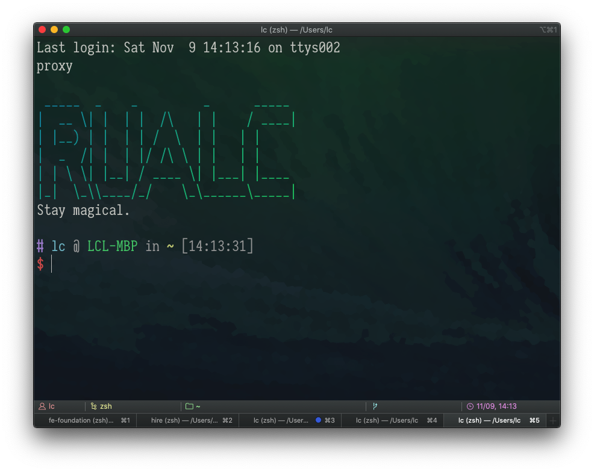

# 命令行 简介

> 返回 [前端开发入门指南](../../note/intro/fe-development-cookbook.md) 系列

## 什么是 命令行

> 命令行界面（英语：Command-Line Interface，缩写：CLI）是在图形用户界面得到普及之前使用最为广泛的用户界面，它通常不支持鼠标，用户通过键盘输入指令，计算机接收到指令后，予以执行。也有人称之为字符用户界面（character user interface, CUI）。

- [Computers 101: terminals, kernels and shells](https://www.integralist.co.uk/posts/terminal-shell/)
- [终端、Shell、tty 和控制台（console）有什么区别？](https://www.zhihu.com/question/21711307)
- [什麼是程序 (Process) - 鳥哥的 Linux 私房菜](http://linux.vbird.org/linux_basic/0440processcontrol.php)

## 打开和使用 命令行

打开系统自带的终端，然后使用命令行界面：

- Mac（Terminal）
  - 按 <kbd>Cmd</kbd>+<kbd>Space</kbd> 打开 `Spotlight Search` 或 `聚焦搜索`
  - 键入 `terminal` 或 `终端`
  - 选择 `Terminal.app` 或 `终端` 启动
- Windows（CMD 或 PowerShell）
  - 按 <kbd>Win</kbd> 键（或鼠标点击屏幕左下角的徽标），打开 Windows 菜单
  - 键入 `cmd` 或 `powershell`
  - 选择 `CMD` 或 `命令提示符` 或 `Windows PowerShell` 启动

将会启动一个黑色的窗口，然后：

- 键入 `ls` 或 `dir` 并回车

这个命令将会在终端中，打印显示当前文件夹下的所有文件。  
这样就完成了一个基本的命令行操作。

这是我的终端界面 ↓（参考下一篇文章 [打造趁手的终端](../../note/workspace/terminal-config.md)）



## 为什么要使用 命令行

- 很多优秀工具 _只有_ 或 _优先_ 提供命令行的版本（如 Node.js、Brew）
- 命令行很方便
  - 相比定位鼠标，敲键盘可以直接通过肌肉记忆完成，鲁棒性高
  - 常用工作流可以封装成代码脚本，一组快捷键或几个字符就能轻松执行
- 降低资源消耗（如远程登录）

## 命令行 相关

### 命令行 中的退出/中断

有一个著名的问题：  
[How To Exit Vim? Multiple Ways To Quit Vim Editor](https://itsfoss.com/how-to-exit-vim/)

VI 或 VIM 是一个 Linux 上流行的命令行编辑器，  
常用于远程登录时的文件编辑。

它的退出命令是通过键入 `:q` 并回车

其他不同工具的退出方式可能是以下几种之一：  
<kbd>Ctrl</kbd>+<kbd>C</kbd>、<kbd>Ctrl</kbd>+<kbd>D</kbd>、<kbd>Q</kbd>、  
`exit`、`quit`、`exit()`

### 命令的帮助文档

一般来说，不可能记住所有命令的所有用法，  
这时候，懂的如何查询文档就非常重要。

在命令行中，有以下几种查询方式：

- 命令**内置**的 `help` 子命令，  
  用法例如： `git help`、`git --help`、`git add --help`
- `man`：Unix 系统和 PowerShell **自带**的命令，  
  用法例如：`man ls`
- `tldr`：一个需要 [安装](https://github.com/tldr-pages/tldr) 的工具，能够显示其他命令的**常见用法**，  
  用法例如：`tldr ls`、`tldr git`、`tldr git add`

* [explainshell](https://explainshell.com/)：一个在线解释网站，能够解释你输入的命令和参数

### 管道

Unix 中有管道的概念，用于拼接不同命令，  
将上一个命令的输出当做下一个命令的输入，  
实现命令的组合运用。

命令的拼接有两种主要方式：

[管道 (Unix)](<https://zh.wikipedia.org/wiki/%E7%AE%A1%E9%81%93_(Unix)>)  
下面 `ls` 和 `tail` 是两个独立的命令，`|` 是管道

```bash
ls -l | tail -n 2
```

[xargs](https://zh.wikipedia.org/wiki/Xargs)  
下面 `where` 和 `ls` 是两个命令，`xargs` 用于传递参数

```bash
where bash | xargs ls -la
```

### 环境变量

使用 terminal 时，每个新窗口都将基于系统环境变量和启动配置建立一个独立的会话，  
所谓环境变量，也就是 `PATH`，  
所谓启动配置，也就是 `~/.bashrc`、`~/.zshrc` 等配置文件，

任何未固化的数据和设定都将在窗口关闭后丢失，  
所以需要根据需求自己调整配置文件。  
（参考后文中的提到的 `dotfile`）

有一个名为 `tmux` 的命令行工具，可以在一个窗口内显示和管理多个窗口（session）

### 术语解释

- **Terminal**：终端，曾经指一类计算机硬件，现在泛指 Terminal emulator，也就是虚拟终端（一类软件）
- **shell**：壳层，前接 Terminal、后接 Kernel 的一层接口，指终端软件启动后窗口中的看到的内容

* **CLI**：Command-line interface，命令行界面
* **GUI**：Graphical user interface，图形用户界面
* **Unix-like**：泛指所有具有类似 Unix 表现和行为的系统。

- **Kernel**：内核，系统底层代码
- **console**：控制台，曾经指一类计算机硬件，现在泛指调试面板（如浏览器的）
- **tty**：来源于 Teletypewriter 的缩写，指上世纪计算机硬件终端的打字机部分，现在泛指虚拟终端的输入界面
- **session**：会话，指一组执行命令的环境，由虚拟终端提供。  
  创建多个会话（表现为多窗口或切换）可以并行处理不同任务。
- **PATH**：环境变量，系统提供的配置入口，用于检索可执行文件

* **dotfile**：泛指以 `'.'` 开头的文本文件，在 Unix-like 系统中是隐藏文件，  
  一般用作程序配置，例如：`.bashrc`，复制粘贴该文件即可直接同步配置
  - 一个高赞配置 [Mathias’s dotfiles](https://github.com/mathiasbynens/dotfiles)
  - 我的 [基本环境自动配置脚本（未完成）](https://github.com/seognil/dotfiles)
* **rc**：常用于 dotfile 文件名的结尾，表示这是配置文件  
  （rc 可解释为 runcom、run commands、runtime configuration 等）  
  如：`.bashrc、.zshrc、.npmrc`

- **ping**：命令行中检查地址可访问性的工具，例如 `ping fe.rualc.com`
- **curl**：是 Client URL 的缩写，命令行中的地址访问工具，例如 `curl -L fe.rualc.com`

### 不同的 shell

不同的 shell，语法有一些差别。  
在选择自己的主力 shell 时，根据自己的喜好，以及需要注意兼容性。

- [Introduction to if - Bash](http://tldp.org/LDP/Bash-Beginners-Guide/html/sect_07_01.html)
- [Conditionals (If, Else, Switch) - Fish](https://fishshell.com/docs/current/tutorial.html#tut_conditionals)

```bash
# bash
function comp {
  local value=$1
  if [ $value -gt 100 ]; then
    echo "'$value' is in (100, Inf)"
  elif [ $value -gt 50 ]; then
    echo "'$value' is in (50, 100]"
  else
    echo "'$value' is in (-Inf, 50)"
  fi
}

# fish
function comp
  set -l value $argv[0]
  if [ $value -gt 100 ]
    echo "'$value' is in (100, Inf)"
  else if [ $value -gt 50 ]
    echo "'$value' is in (50, 100]"
  else
    echo "'$value' is in (-Inf, 50)"
  end
end
```

### proxy 和 registry

对于网路，理解相关概念能够更好地运用它

#### proxy

proxy 是指“代理”，作用可能是以下之一

- 授权访问（防火墙）
- 加密通讯（安全性）
- 节约网络流量（内网）
- 网络质量优化（稳定性）

#### registry

在命令行中下载工具，实际上是从某个地址传输数据。  
（如 `github.com`、`npmjs.org`）

根据自己的网络环境，进行“换源”操作，或许可以提高下载速度，  
如调整 `brew remote`、`npm registry` 等。
